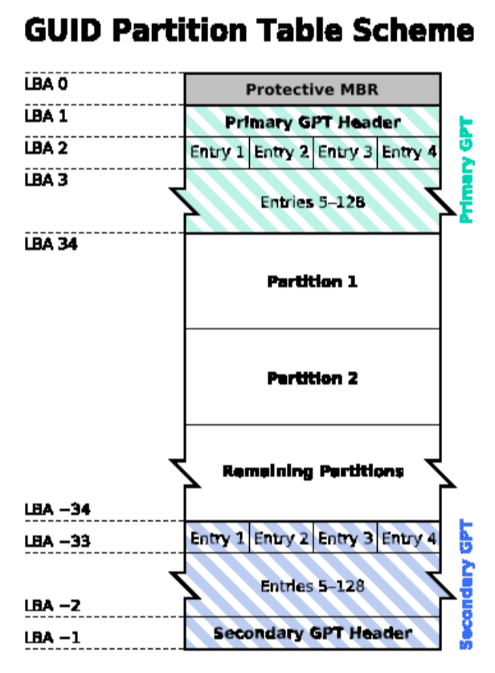
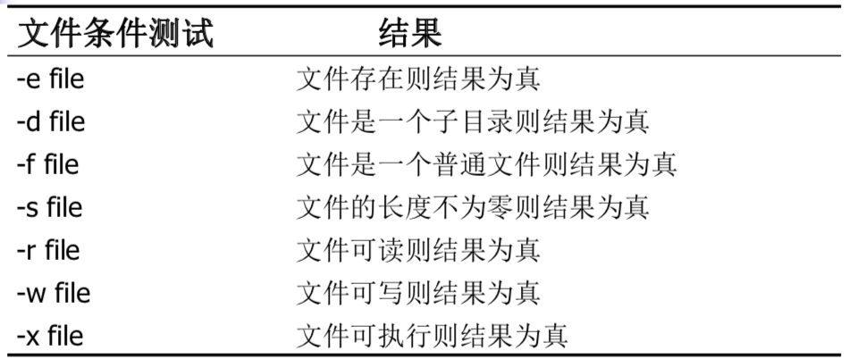
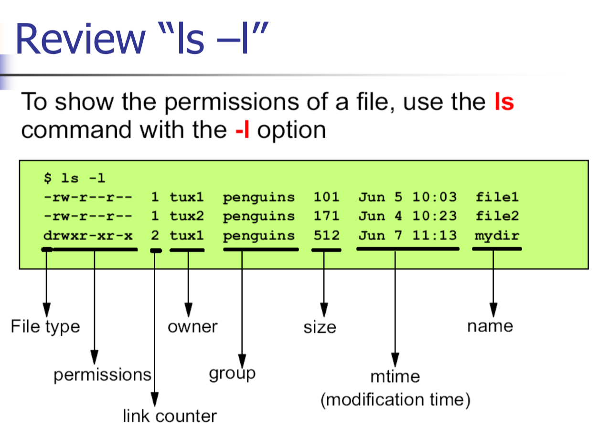

# Linux基础

## Linux基础知识

### 历史

**Linux 创始人**： Linus torvalds

- GNU指开源社区，收集开源软件，制定开源规则

- Linus编写了Linux内核的第一个版本

  - Linus' s UNIX -> Linux

  

  **GNU为Linux提供开源软件**

### 各种发行版

- Redhat -> Fedora
- Debian: 只接受开源软件
- Ubuntu: 对软件质量要求高
- SuSe
- Mandrake

## Linux安装

### 分区理论

**分区在基于Intel的计算机上是必要的**

#### MBR分区

- 最多4个主分区（MBR中分区表64字节的限制，一个分区需要16字节，所以最多只能识别4个主分区）

- 或者：主分区 * 3 + 扩展分区 * 1

  - 一个扩展分区可以拥有不限量的逻辑分区（Linux：max59）
- 在MBR硬盘中，分区号1－4是主分区（或者扩展分区），逻辑分区号只能从5开始。


##### 主引导记录

- Size：512 bytes（first sector of hd）

- Addressed by BIOS

- Content：

  - 446字节的程序代码 (引导一个OS)
  - 64字节的分区表：最多4个条目
  - 2 bytes “magic number” (0x55AA) **结束标志**

- MBR的512个字节主要分为两个部分：

  - 一个是446字节的pre-boot区（预启动区）
    - **其中的硬盘引导程序的主要作用是检查分区表是否正确并且在系统硬件完成自检以后将控制权交给硬盘上的引导程序（如GNU GRUB）。它不依赖任何操作系统，而且启动代码也是可以改变的，从而能够实现多系统引导。**
  - 一个是64字节的磁盘分区表，可以对四个分区的信息进行描述，其中每个分区的信息占据16个字节。

#### **GUID分区：**



## 文件系统

### 文件系统

文件系统：操作系统中负责存取和管理文件的部分

文件及其某些属性的集合，它为引用这些文件的文件序列号提供了一个名称空间。 (susv3)

Linux中的文件系统

- **VFS(Virtual File System)：采用标准的Unix系统调用读写位于不同物理介质上的不同文件系统,即为各类文件系统提供了一个统一的操作界面和应用编程接口。**VFS是一个可以让open()、read()、write()等系统调用不用关心底层的存储介质和文件系统类型就可以工作的粘合层。
- EXT2, EXT3, FAT32, ...

### 磁盘分区

- 最低要创建：
  - /, 750MB (1.5G or more recommended)  
  - Swap, size equal to amount of memory

- 推荐: /boot (16MB) 

- 可以创建其他分区: 
  - /usr, /usr/local, /var, /tmp, /opt, /home 
  - Linux各目录及其详细介绍.pdf

- Linux下的默认分区程序是**fdisk** 

  - 发行版可以添加他们自己的分区工具

  ### Linux中软件的安装(手动编译安装)

- 从一个tarball开始（tarball是linux系统下最方便的打包工具，是以tar这个指令来打包与压缩的档案。）

  - tar zxvf application.tar.gz   
  - cd application
  - ./configure          预配置
  - make                  源代码的编译和链接
  - su -                   获取root权限
  - make install         安装

- tarball命令参数：

  - "x"选项用于解包，
  - "c" 选项用于打包，
  - "v"选项提供更多过程信息。
  - "f"选项用于指明包文件名。

- 另外，参数 "z"  表示 tar 包是被 gzip 压缩过的，所以解压时需要用 gunzip 解压

## 虚拟终端

- 在大多Linux发行版中，控制台会模拟出多个虚拟终端
- 每个虚拟终端可以看作一个独立的，直连的控制台
  - 不同的用户可以使用不同的虚拟终端
  - 典型设置
    - VT 1-6: 字符模式登录
    - VT 7: 图形界面登录提示符 (if enabled) 
  - 用`Alt-Fn`(or `Ctrl-Alt-Fn` if in X)在不同的虚拟终端之间切换

## Linux命令

- 命令和提示符
  - 可以自己配置
  - `$` - "普通用户身份登录“
  - `#` - "root用户身份登录"

### 命令语法

- Linux命令有下列形式
  - $ command option(s) argument(s)

### 一些基本Linux命令

- `passwd`：更改密码
- `mkpasswd`：生成一个随机密码
- `date`, `cal`：取得今天的日期，显示日历
- `who`, `finger`：找出有哪些人在当前系统中处理活跃状态
- `clear`：清除屏幕
- `echo`：向屏幕上打印一条信息
- `write`, `wall` ,`talk`; `mesg`
  - write 用户名 [终端号]   向别人发送信息,接收者要回复的话，必须自己也用write命令才可以
  - wall 会将讯息传给每一个 mesg 设定为 yes 的上线使用者
  - mesg [y|n] 决定是否允许其他人传讯息到自己的终端机介面
- ...

## 文件 & 目录

### 文件

​	数据的集合

​	一个可以被写入、读出的对象。文件有确定的属性，包括权限和类型。

### 文件结构

- 通常是以下几种
  - **字节流**
  - 记录序列
  - 记录树
- Linux中：字节流

### 7种文件类型

- 常规文件
  -  文本或代码数据；没有特别的内部结构
-  character special file 字符特殊文件（字符设备文件）
- block special file 块特殊文件（块设备文件）
  - 特殊文件：代表硬件或逻辑设备，不存在于真实的磁盘上
  - 可以在`/dev`目录下找到
- socket：网络文件，主要用于不同计算机之间网络通信
- symbolic link 符号链接
  - 软链接
  - 硬链接
- 目录
  - 一个内容表格
  - 目录内文件的一个列表
- 管道文件

### 目录结构

- 所有的Linux目录都包含在一个虚拟的“统一文件系统”中
- 物理设备都挂载在挂载点上
  - 软盘
  - 硬盘分区
  - CD-ROM驱动

### 基本命令（1）

- 目录操作命令
  - `pwd`：打印工作目录
  - `cd`：改变工作目录
  - `mkdir`：创建目录
  - `rmdir`：删除目录
  - `ls`：列出目录内容
    - -l, -a, -R 等参数

### 基本命令（2）

- 文件操作命令
  - `touch`：更新文件的 访问 和/或 更改时间
  - `cp`：复制文件
  - `mv`：移动或重命名文件
  - `ln`：链接文件
  - `rm`：删除文件
  - `cat`：打印文件内容
  - `more`/`less`：一页一页地显示文件

### 文件权限

- 三种访问级别：
  - User：创建该文件的用户
  - Group：拥有这个文件的组内的所有用户
  - 所有其他人
- 三种权限：
  - Read(r)：读文件内容或列出目录内容
  - Write(w)：改变文件内容或者创建/删除目录内的文件
  - Execute(x)：将文件作为一个程序执行或者将目录作为一个活跃目录访问

### 查看文件权限

- ls -l
- 
- 第一项一共有1+3*3=10位，每个访问权限的3位分别是r, w, x权限
  - 1：文件类型
    - -：文件
    - d：目录
  - 2-4：用户访问权限
  - 5-7：组访问权限
  - 8-10：其他用户访问权限
- 如第三行：
  - d：目录
  - rwx：用户具有所有权限
  - r-x：组具有rx权限
  - r-x：其他用户具有rx权限

### 改变权限

- change mode 命令：chmod

- **chmod <who operator what> filename**
  - who:
    - `u = owner of file`
    - `g = group`
    - `o = other users on the system`
    - `a = all ( u+g+o)`
  - operator:
    - `+ : 增加权限`
    - `- : 解除权限`
    - `= : 清除权限，设为指定权限`
  - what:
    - `r = read`
    - `w = write`
    - `x = execute`
- 文件和目录权限也可以被指定为一个八进制数
- 

### 默认权限

- 文件 ：`-rw-r--r--` 644
- 目录 : `drwxr-xr-x` 755

## 进程

### 什么是进程？

- 一个进程是一个任务
- 进程是一个正在执行的程序实例。由`执行程序`、它的当前`值`、`状态信息`以及`通过操作系统管理此进程执行情况的资源`组成
- 

### 开始和结束一个进程

- 所有的进程都是被别的进程启动
  - 父/子关系
  - 一个例外：init（PID 1）是被内核自己启动的
  - 一个树状结构
- 一个进程可能由两个方式结束
  - 完成后，进程自行终止
  - 一个进程被另一个进程发送的信号终止

### 基本命令

- ps：报告进程状态
- pstree：显示进程树
- jobs, fg, bg, <ctr-z> :job controlling
- kill：杀掉进程
- nohup：运行一个命令，无视挂起信号
- nice, renice：管理进程优先序
- top：显示进程的动态信息

### 后台主流程序（Daemons）

- “Daemon”是指永不结束的进程，通常是一个管理系统资源的系统进程，如打印机队列，或网络服务

## 帮助 Help

### 怎么寻求帮助

- `man` （manual，使用手册存储在`/usr/man`)
- `info`
- `command --help`
- HOWTO文档
- 上网查

## UNIX概述

- 早期的UNIX
  - 一个简单的文件系统
  - 一个进程子系统
  - 一个Shell
- 内核和核外程序
- 

- 

- 程序视角
  - 
    - IPC：进程间通信

## 基本命令

### 文件操作

- 列出目录内容：`ls`, `dir`, `vdir`(ls -l)
- 创建特殊文件：`mkdir`, `mknod`, `mkfifo`
- 文件操作：`cp`, `mv`, `rm`
- 修改文件属性：`chmod`, `chown`, `chgrp`, `touch`
- 查找文件：`locate`, `find`
- 字符串匹配：`grep`(`egrep`)
- 其它：`pwd`, `cd`, `ar`, `file`, `tar`, `more`, `less`, `head`, `tail`, `cat`
  - `more`/`less`命令在Linux下的功能是相同的

### 进程操作

- `ps`, `kill`, `jobs`, `fg`, `bg`, `nice`

### 其它

- `who`, `whoami`, `passwd`, `su`, `uname`, ...
- `man`

### 重定向

- 重定向
  - 标准输入`stdin`、标准输出`stdout`、标准错误`stderr`
    - 对应的文件描述符：0，1，2
    - C语言变量：stdin, stdout, stderr
  - <, >, >>, 2>
- 综合例子：`command <file1 >file2 2>>&1`
  1. `<file1` command命令以file1内容作为输入
  2. `>file2` 将执行结果<u>覆盖式</u>输出到file2，此时文件描述符1对应的标准输出已经被重定向到file2
  3. `2>>&1` 错误输出<u>追加</u>到file2，由于2中1被重定向到file2，所以`&1`指向file2

### 管道

- 管道
  - 一个进程的输出作为另一个进程的输入

### 环境变量

- 环境变量
  - 操作环境的参数
  - 查看和设置环境变量
    - `echo`
    - `env`：显示当前用户的环境变量；
    - `set`

### 高级命令与正则表达式

- `find`：在指定目录下查找文件
- `grep`：查找文件里符合条件的字符串


# Shell编程

#### 1. Linux shell 命令

高级命令。 Find 要。sed 不用。grep 要掌握

#### 2. Linux shell 脚本

自己能够写shell脚本。read 基本功能

引号的用法，转义和区别

算数扩展

参数扩展不考

即时文档要求掌握


## 什么是Shell

- Shell：
  - 一个命令解释器和编程环境
- 用户和操作系统之间的接口
- 作为核外程序而存在

## 各种不同的Shell

	

## Shell的双重角色

- 命令解释程序
  - Linux的开机启动过程；进程树
  - Shell的工作步骤：
    - 打印提示符；得到命令行；解析命令；查找文件；准备参数；执行命令
- 独立的程序设计语言解释器
  - KISS（Keep It Small and Stupid）
  - 可重用工具
  - 重定向和管道

## 编写脚本文件

- 脚本文件

  - 注释

  - 退出码（exit code）

  - Example

  - ```bash
    #!/bin/bash
    # Here is comments
    for file in *; do
    	if grep –l POSIX $file; then
    		more $file 
    	fi
    done 
    exit 0
    ```

    

## 执行脚本文件

- 方法1:
  - `sh script_file`
- 方法2:
  - `chmod +x script_file`（chown, chgrp optionally）
  - `./script_file`
- 方法3:
  - `source script_file` 或者 `.script_file`
  - 与前两种方法的区别是，法3在当前Shell中读取并执行脚本，而不是产生一个子进程，所以可以获取shell中变量

## 用户环境

- .bash_profile, .bash_logout, .bashrc
  - .bash_profile：用户登录时被读取，其中包含的命令被bash执行
  - ..bashrc：启动一个新的shell时读取并执行
  - .bash_logout：退出登录时读取执行
- Alias
  - alias/unalias command
  - 例：alias outdated="brew update && brew outdated ; brew cask outdated"
- 环境变量
  - export command
  - export, env & set command

## 变量

- 用户变量
- 环境变量
- 参数变量和内部变量

### 用户变量：

- 用户变量：

  - 用户在shell脚本里定义的变量

- 变量的赋值和使用

  - var=value
  - echo $var

- read命令：从标准输入中读取变量

  - 用法：read var（读取并赋值给var） 或 read

    - -p 直接指定一个提示：

      - ```shell
        read -p "Enter a number"
        ```

    - -n1 定义输入文本的长度

    - -s 安静模式，输入字符时不在屏幕上显示，可用于输入密码

  - REPLY variable：$REPLY保存上一个read的结果

    - 当read后面省略变量时，REPLY可以保存其结果

- 引号的用法

  - 双引号，单引号
    - 双引号：`$, ``(不是单引号), \`这三种字符会被bash解释，其它字符保持原义
    - 单引号：所有字符保持原义，没有转义字符`\`，变量引用符`$`等
  - 转义符 "\"

### 环境变量

- 环境变量：Shell环境提供的变量。通常使用大写字母做名字
- 

### 参数变量和内部变量

- 参数变量和内部变量
  - 调用脚本程序时如果带有参数，对应的参数和额外产生的一些变量
  - 


## 条件测试

- 退出码
- test命令
  - test expression 或 [ expression ]
- test命令支持的条件测试
  - **字符串比较**
    -  
  - **算术比较**
    - 
  - **与文件有关的条件测试**
    - 
  - **逻辑操作**
    - 


## 条件语句

- if语句
- case语句

### if语句

- 基本形式

  - ```shell
    if [ expression ]
    then 
    	statements
    elif [ expression ] 
    then
    	statements 
    elif ...
    else
    	statements 
    fi
    ```

- 紧凑形式

  - 使用";"  (同一行上多个命令的分隔符)

  - 例1

  - ```shell
    if [ -f ~/.bashrc ]; then # 紧凑形式
    	. ~/.bashrc 
    fi
    ```

    

  - 例2

  - ```shell
    #!/bin/sh
    echo “Is this morning? Please answer yes or no.” 
    read answer
    if [ “$answer” = “yes” ]; then
    	echo “Good morning”
    elif [ “$answer” = “no” ]; then
    	echo “Good afternoon” 
    else
    	echo “Sorry, $answer not recognized. Enter yes or no”
    	exit 1 
    fi
    exit 0
    ```

### case语句

- 基本形式

  - ```shell
    case str in
    	str1 | str2) statements;; # 注意这里两个";"
    	str3 | str4) statements;; 
    	*) statements;;
    esac
    ```

- 例子

  - ```shell
    #!/bin/sh
    echo “Is this morning? Please answer yes or no.” 
    read answer
    case “$answer” in
    	yes | y | Yes | YES) echo “Good morning!” ;; 
    	no | n | No | NO) echo “Good afternoon!” ;; 
    	*) echo “Sorry, answer not recognized.” ;;
    esac exit 0
    ```

## 重复语句

- for
- while
- until
- select

### for语句

- 形式

  - ```shell
    for var in list
    do 
    	statements
    done		
    ```

- 适用于对一系列字符串循环操作

- 例

  - ```shell
    #!/bin/sh
    for file in $(ls f*.sh); 
    do 
    	lpr $file
    done 
    exit 0
    ```

    

### while语句

- 形式

  - ```shell
    while condition
    do
    	statements
    done
    ```

### until语句

形式

- ```shell
  until condition
  do
  	statements
  done
  ```

### select语句

- 形式

  - ```shell
    select item in itemlist
    do
    	statements
    done
    ```

- 作用：生成菜单列表

- 例

  - ```shell
    #!/bin/sh
    clear
    select item in Continue Finish
    do
    	case “$item” in
    		Continue) ;;
    		Finish) break ;;
    		*) echo “Wrong choice! Please select again!” ;;
    	esac 
    done
    
    # 运行结果:
    # 1) Continue
    # 2) Finish
    # #? 
    # 这个时候输入1/2即可
    ```

## 命令表和语句块

- 命令表（命令组合）
- 语句块


### 命令表

- 分号串联
  - command1 ; command2 ; ...
- 条件组合
  - AND
    - 格式：statement1 && statement2 && ...
  - OR
    - 格式：statement1 || statement2 || ...

### 语句块

- 形式

  - ```shell
    {
    	statement1
    	statement2
    	...
    }
    ```

  - 或

  - ```shell
    { statement1 ; statement2 ; ... ; }
    ```

### 函数

- 形式

  - ```shell
    func()
    {
    	statements
    }
    ```

- 局部变量

  - `local`关键字
- 函数的调用
  - `func para1 para2 ...`
  - 返回值
    - `return`

## 其它

- 杂项命令
  - break, continue, exit, return, export, set, unset, trap, ":", ".", ...
- 捕获命令输出
- 算术扩展
- 参数扩展
- 即时文档

### 杂项命令

- `break`: 从for/while/until循环退出
- `continue`: 跳到下一个循环继续执行
- `exit n`: 以退出码”n”退出脚本运行
- `return`: 函数返回
- `export`: 将变量导出到shell，使之成为shell的环境变量
- `set`: 为shell设置参数变量
- `unset`: 从环境中删除变量或函数
- `trap`: 指定在收到操作系统信号后执行的动作
- “`:`”(冒号命令): 空命令
- `source`或“`.`”(句点命令): 在当前shell中执行命令

### 捕获命令输出

- 语法

  - ```
    $(command) 或 `command`
    ```

- 例

  - ```shell
    #!/bin/bash
    echo "The current directory is $PWD"
    echo "The current directory is $(pwd)"
    exit 0
    
    # 输出:
    # The current directory is /Users/fangborong
    # The current directory is /Users/fangborong
    # 两条命令输出结果一样但原理不一样
    # 第一种是直接打印环境变量
    # 第二种是捕获了pwd这条命令的输出结果，然后用echo输出
    ```

### 算术扩展

- 格式：$((…))

- 例

  - ```shell
    x=1
    x=$x+1
    echo $x 
    # 输出: "1+1"
    
    x=1
    x=$(($x+1))
    echo $x
    # 输出: "2"
    ```

  

### 参数扩展

### 即时文档

- 在shell脚本中向一条命令传送输入数据

- 例

  - ```shell
    #!/bin/bash
    cat >> file.txt << !CATINPUT!
    Hello, this is a here document. 
    !CATINPUT!
    ```

    

# linux程序设计

## Linux编程技术支持

### 1.编译流程


gcc的编译流程分为了四个步骤:

- 预处理，生成预编译文件（.文件）：gcc –E hello.c –o hello.i
- 编译，生成汇编代码（.s文件）：gcc –S hello.i –o hello.s
- 汇编，生成目标文件（.o文件）：gcc –c hello.s –o hello.o
- 链接，生成可执行文件：gcc hello.o –o hello

### 2.静态库与动态库区别

 编写两个简单的程序（fred.c, bill.c），将其编译为目标文件，并分别生成静态库和动态库。再编写程序调用之，说明库的使用。

（1）生成静态链接库

gcc -c h.c -o h.o

ar cqs libh.a h.o   

//ar是生成库的命令，cqs是参数,libh.a是生成的静态链接库须以lib开头，h是库名,a表示是静态链接库，h.o是刚才生成目标文件

（2）.生成动态链接库

gcc -c h.c -o h.o

生成动态链接库用gcc来完成

gcc -shared -WI -o libh.so h.o

//-shared -WI是参数，libh.so是生成的静态链接库须以lib开头，h是库名,so表示是动态链接库，h.o是刚才生成目标文件

（3）将生成的libh.a，libh.so拷贝到/usr/lib或/lib下

（4）编译带静态链接库的程序

gcc -c test.c -o test.o

gcc test.o -o test -WI -Bstatic -lh

//-WI -Bstatic表示链接静态库，-lh中-l表示链接，h是库名即/usr/lib下的libh.a

（5）编译带动态链接库的程序

gcc -c test.c -o test.o

gcc test.o -o test -WI -Bdynamic -lh

//-WI -Bdynamic表示链接动态库，-lh中-l表示链接，h是库名即/usr/lib下的libh.so

（6）运行./test得到结果


<https://www.cnblogs.com/codingmengmeng/p/6046481.html>

本质上来说，库是一种可执行代码的二进制形式，可以被操作系统载入内存执行。库有两种：**静态库（.a、.lib）和动态库（.so、.dll）**。

静态库、动态库区别来自<u>【链接阶段】如何处理库，链接成可执行程序</u>。分别称为静态链接方式、动态链接方式。


**静态库**：在链接阶段，会将汇编生成的<u>目标文件.o</u>与引用到的<u>库</u>一起链接打包到可执行文件中。其实一个静态库可以简单看成是**一组目标文件（.o/.obj文件）的集合**，即很多目标文件经过压缩打包后形成的一个文件。

**静态库特点：**

1. 静态库对函数库的链接是放在编译时期完成的。

2. 程序在运行时与函数库再无瓜葛，移植方便。

3. 浪费时间和空间，因为所有相关的目标文件与牵涉到的函数库被链接合成一个可执行文件。

4. 程序员不需要显式的指定所有需要链接的目标模块，因为指定是一个耗时且容易出错的过程；

   (静态库对程序的更新、部署和发布页会带来麻烦。如果静态库libxx.lib更新了，所有使用它的应用程序都需要重新编译、发布给用户)


**动态库**：动态库在程序编译时不会被链接到目标代码中，而是在程序运行时才会被载入。不同的应用程序如果调用相同的库，那么在内存里只需要有一份该共享库的实例。

**动态库特点：**

1. 动态库把对一些库函数的链接载入推迟到程序运行的时期。
2. 可以实现进程之间的资源共享。（因此动态库也称为共享库）
3. 将一些程序升级变得简单。
4. 甚至可以真正做到链接载入完全由程序员在程序代码中控制。


区别：

|                    | 静态库 .a .lib                                               | 动态库 .so .dll                              |
| ------------------ | ------------------------------------------------------------ | -------------------------------------------- |
| 对库函数的链接时期 | 编译时                                                       | 程序运行时                                   |
| 运行时             | 程序在运行时与函数库再无瓜葛，移植方便                       | 动态库在程序运行时被载入                     |
| 空间消耗           | 所有相关的目标文件与牵涉到的函数库被链接合成一个可执行文件，空间消耗大 | 可以实现进程之间的资源共享                   |
| 程序升级           | 静态库对程序的更新、部署和发布页会带来麻烦。<br />如果静态库libxx.lib更新了，所有使用它的应用程序都需要重新编译、发布给用户 | 简单                                         |
|                    | 程序员不需要显式的指定所有需要链接的目标模块，因为指定是一个耗时且容易出错的过程 | 可以做到链接载入完全由程序员在程序代码中控制 |


### 3.为什么要做链接?(link)

 **链接的作用（软件复用）：**

1. 使得分离编译成为可能；

2. 动态绑定(binding):使定义、实现、使用分离

    

### 4.预处理 – 编译是怎样一回事

​	预处理就是将**要包含(include)的文件插入原文件**中、**将宏定义展开**、**根据条件编译命令选择要使用的代码**，最后将这些代码输出到一个 **".i" 文件**中等待进一步处理。

​	预编译过程主要处理那些源代码文件中以 "#"开始的预编译指令。比如"#include"、"#define"等，主要处理规则如下：

- 将所有的 **"#define"** 删除，并且展开所有的**宏定义**

- 处理所有**条件预编译**指令，比如"#if"、"#ifdef"、"#elif"、"#else"、"#endif"

- 处理**"#include"**预编译指令，**将被包含的文件插入到该预编译指令的位置**。注意，这个过程是递归进行的，也就是说被包含的文件可能还包含其他文件

- 删除所有的注释"//"和"/* */"

- 添加行号和文件名标识，比如 #2 "hello.c" 2，以便于编译时编译器产生调试用的行号信息及用于编译时产生编译错误或警告时能够显示行号

- 保留所有的 #pragma 编译器指令，因为编译器需要使用它们

  

### 5.gcc g++编译命令及常见参数

**gcc -c (编译)** 

**gcc (链接 或者 编译 + 链接)** 

**g++ (C++对应的命令，其实就是换了前端)** 


Usage:
 	gcc [options] [filename] 

Basic options:

​	-E: 只对源程序进行预处理(调用cpp预处理器) 

​	-S: 只对源程序进行预处理、编译

​	-c: 执行预处理、编译、汇编而不链接

​	-o output_file: 指定输出文件名

​	-g: 产生调试工具必需的符号信息

​	-O/On: 在程序编译、链接过程中进行优化处理 

​	-Wall: 显示所有的警告信息 

​	-Idir: 指定额外的头文件搜索路径

​	-Ldir: 指定额外的库文件搜索路径 

​	-lname: 链接时搜索指定的库文件

​	-DMACRO[=DEFN]: 定义MACRO宏


### 6.常用扩展名


### 7.make makefile(要求**读懂** 不要求写出来)

​	makefile的流程要知道！


## 文件系统

### 1.文件和文件系统

文件：

​	一个可以被写入或读出的对象。文件具有一些属性，包括访问权限和类型。

文件系统：

​	操作系统中负责存取和管理文件的部分

​	文件集合及其某些属性。 它为文件序列号提供命名空间。

### 2.七种文件类型

1. regular file普通文件（-）：包含了某种形式的数据
2. character special file字符设备文件（c）：用于系统中的无缓冲写的设备文件
3. block special file块设备文件（b）：用于系统中的缓冲写设备文件，如磁盘设备。系统中的所有设备要么是字符文件，要么是块设备文件。
4. fifo管道文件（p）：用于进程间通信
5. socket套接字文件（s）：用于网络间通信
6. symbolic link符号链接文件（l）：这种文件指向另一个文件
7. directory目录（d）：包含了其他文件的名字和inode号

### 3.VFS


#### 作用

​	采用标准的Unix系统调用读写位于不同物理介质上的不同**文件系统**。VFS是一个可以让open()、read()、write()等系统调用不用关心底层的**存储介质和文件系统类型**就可以工作的**粘合层**。屏蔽底层系统的具体形式。与以下(??)磁盘文件系统，**为底层的文件系统提供了统一的抽象**。

#### VFS Model

​	Virtual; only exists in memory

​	**组件（<u>vfs四个对象及含义要知道</u>）**

##### 1.**super block超级块对象**

​		一个已安装的文件系统的控制信息。

​		超级块用来描述<u>特定文件系统</u><u>的信息</u>。它存放在磁盘特定的扇区中 ,它在使用的时候将信息存在于内存中。当<u>内核对一个文件系统进行初始化和注册时在内存为其分配</u>一个超级块，这就是VFS超级块。即，VFS超级块是各种具体文件系统在安装时建立的，并在这些文件系统卸载时被自动删除 。

##### 2.**i-node object索引节点对象**

​		存储了文件的相关信息，代表一个物理节点。

​		**ls查看的信息**，文件或目录的<u>静态描述信息，不随进程不同而变化</u>。保存一个文件的通用信息，每个inode有一个inode number，在文件系统中，<u>一个inode number能够唯一地标识一个文件</u>。

​		文件系统处理文件或目录时的所有信息都存放在称为索引节点的数据结构中。文件名可以随时改，但是索引节点对文件是唯一的（它是随文件的存在而存在）。

​		<u>具体文件系统的索引节点是存放在磁盘上的，是一种静态结构</u><u>，要使用它，必须将其调入内存，填写 VFS的索引节点。VFS索引节点也称为动态节点。</u>(**即VFS索引节点仅当文件被访问时才在内存中创建**)。

##### 3.**dentry object目录项对象**

​		一个路径的各个组成部分，不管是目录还是文件，都是一个dentry对象目录项。内容包括索引节点编号，目录项名称长度以及名称。

​		为了方便查找，VFS引入了目录项，每个dentry代表路径中的一个特定部分。目录项也可包括安装点。 描述一个文件和一个名字的对应关系，或者说dentry就是一个“文件名”。

​		我们可以看到不同于VFS 中的索引节点对象和超级块对象，<u>目录项对象中没有对应磁盘的数据结构，所以说明目录项对象并没有真正标存在磁盘上</u>，那么它也就没有脏标志位。

​		dentry和inode的区别（写出来便于理解）：

​		**一个inode可以在运行的时候链接多个dentry**，而d_count记录了这个链接的数量。每个文件都至少有一个dentry(目录项)和inode(索引节点)结构，dentry记录着文件名，上级目录等信息，正是它形成了我们所看到的<u>树状结构</u>；而有关该文件的组织和管理的信息主要存放inode里面，它记录着文件在存储介质上的位置与分布。同时dentry->d_inode指向相应的inode结构。**dentry与inode是多对一的关系，因为有可能一个文件有好几个文件名(硬链接)。**（看到这里应该就理解了23333）

##### 4.**file object文件对象**

​		已打开文件在**内存**中的表示，主要用于建立进程和磁盘上的文件对应关系。

​		文件对象表示进程已经打开的文件在**内存**中的表示，该对象<u>不是物理上的文件</u>。它是由相应的**open()系统调用创建**，由**close()系统调用销毁**。多个进程可以打开和操作同一个文件，所以**同一个文件也可能存在多个对应的文件对象**。 

​		一个文件对应的文件对象不是唯一的，但对应的索引节点和超级块对象是唯一的。		

##### 5.关系

​		1.超级块对象和inode对象分别对应有物理数据，在磁盘上有静态信息。

​		2.而目录项对象和文件对象描述的是一种关系，前者描述的文件与文件名的关系，后者描述的是进程与文件的关系，所以没有对应物理数据。

​		3.例如有三个不同的进程打开同一个文件，其中有两个进程使用了相同的硬链接。三个进程拥有各自的file object，而只有两个dentry（同一个硬链接对应一个dentry，dentry不随进程打开文件而增加或改变）。两个dentry都指向同一个inode。Inode中不存储文件的名字，它只存储节点号；而dentry则保存有名字和与其对应的节点号，所以就可以通过不同的dentry访问同一个inode。不同的dentry则是同个文件链接（ln命令）来实现的。

数量关系：进程=文件对象>=目录项对象>=索引节点对象 （侯韵晗说的:)）

​	文件对象>=目录项对象：因为可能多个进程打开的是同一个文件链接。

​	目录项对象>=索引节点对象：因为可能存在硬链接，两个硬链接其实对应的是一个文件，即一个索引节点对象。

​		超级块和inode对象分别对应有物理数据，在磁盘上有静态信息。


### 4.软链接和硬链接

#### 特点

##### 硬链接（可对文件，不可对目录）

​	a) 不同的文件名对应同一个inode

​	b) 不能跨越文件系统

​	c) 对应系统调用link

##### 软链接（也叫符号链接）（可对文件，可对目录）（类似windows快捷方式）

> （软链接与硬链接不同，若<u>文件用户数据块中</u>存放的内容是<u>另一文件的路径名的指向</u>，则该文件就是软链接。软链接就是一个普通文件，只是数据块内容有点特殊。软链接有着自己的 inode 号以及用户数据块）

​	a) 存储被链接文件的**文件名(而不是inode)**实现链接

​	b) 可跨越文件系统

​	c) 对应系统调用symlink实现链接

#### 其他补充

​	删除原文件后(原文件也没有任何硬链接文件)软连接不可用，若被指向路径文件被重新创建，死链接可恢复为正常的软链接；换做硬链接则可用。  

​	硬链接创建 ln [原文件名] [连接文件名] 

​	符号链接 ln –s [原文件名] [连接文件名] 

​	<u>ls-l 之前有提过 这里结合软链接和硬链接看</u>：

​		创建软链接时，链接计数 i_nlink 不会增加



### 5.系统调用和库函数

#### 系统调用和库函数的差别

​	都以C函数的形式出现

​	系统调用： 

​		Linux内核的对外接口; 用户程序和内核之间唯一的接口; 提供最小接口 

​	库函数：

​		依赖于系统调用; 提供较复杂功能

​		例:标准I/O库

#### 库函数缓存机制

​	？？？听不清 在录音20:30处

#### 系统调用（ 命令要掌握 <u>编程</u>要会写）

​	是哪些不要分不清楚 要按照题目要求用指定的来调用。

​	flag 打开一个文件可读/可写/可读可写之类的 不会太偏

##### 权限（都要求掌握 ppt上有）

##### 关闭文件

​	奇怪的标志位不考

​	ioctl不考

#### 库函数（**命令要掌握** <u>编程</u>要会写）

​	分清楚库函数和系统调用 要按照题目要求用指定的（指定库函数/系统调用）来调用。

##### 库函数缓存机制（同上）

​		能够理解库函数的缓存机制会带来怎样的影响。

##### 目录操作好像不考

##### 文件锁要看！！


# 内核

## 定义

​	操作系统是一系列程序的集合，其中最重要的部分构成了内核

## 基本功能

​	不需要画图 不考细节 

​	<u>但要知道内核承担了哪些**基本功能**</u>——层次图里的模块的大标题？

​	**内核结构**

​	

​	**Linux内核的能力**：内存管理，文件系统，进程管理，多线程支持，抢占式，多处理支持 

## 内核源代码编译（好像没考）

make
make zImage
make bzImage
make modules

## 驱动

### 1.模块是怎样的一个文件

### 2.加载模块 .ko文件？

### 3.加载模块  释放模块命令

- 底层命令 

  insmod  

  rmmod 

- 高层命令
  modprobe
  modprobe -r 

### 4.模块通讯和依赖 （理解即可

- 通讯

  模块是为了完成某种特定任务而设计的。其功能比较的单一，为了丰富系统的功能，所以模块之间常常进行通信。其之间可以共享变量，数据结构，也可以调用对方提供的功能函数。

- 依赖

  一个模块A引用另一个模块B所导出的符号，我们就说模块B被模块A引用。

  如果要装载模块A，必须先要装载模块B。否则，模块B所导出的那些符号的引用就不可能被链接到模块A中。这种模块间的相互关系就叫做模块依赖。

### 5.用户态程序和内核态程序的区别

1. 

### 6.开发驱动的注意事项

1. 不能使用C库来开发驱劢程序
2. 没有内存保护机制
3. 小内核栈
4. 并发上的考虑

